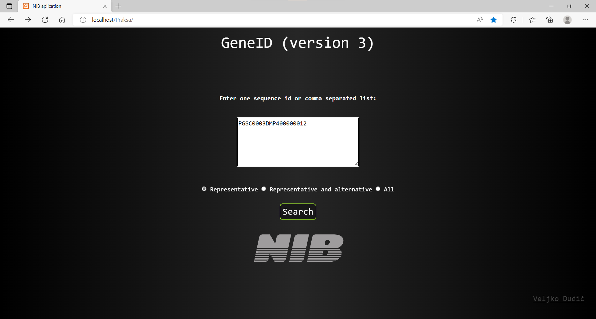
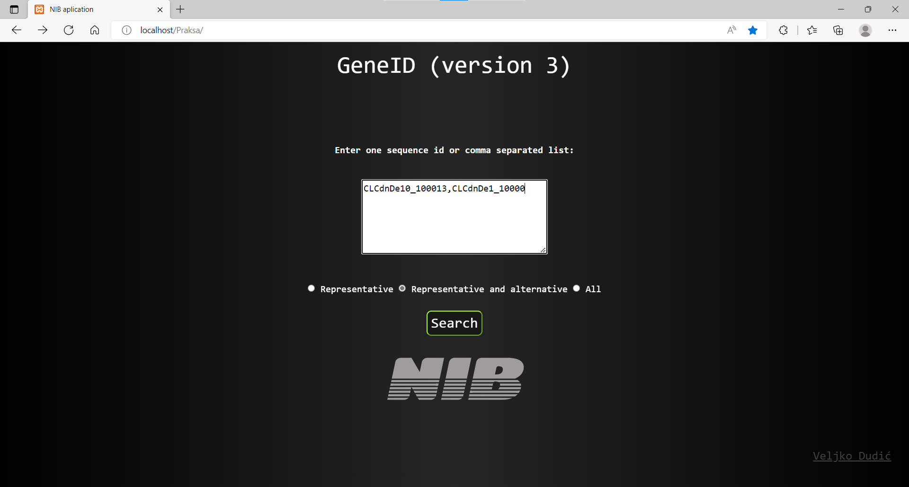
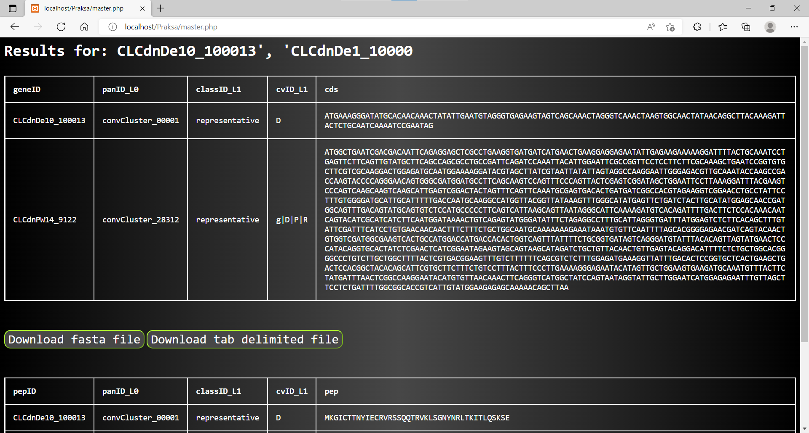

# geneID v3

## About the App


geneID v3 is a browser-based application that takes user’s defined sequenceID, or a comma-separated list of sequenceIDs, and returns corresponding coding sequences (_cds_) and polypeptide (_pep_) sequences in the new tab. 
User is able to choose to download visualised results either as TAB-separated (```.txt```) files or FASTA (```.fasta```) files, or both. 
Moreover, user can choose to conduct a query across three hierarchical levels of information: 
1. Considering representative sequences only
2. Considering alternative and representative sequences
2. All sequences – i.e. alternative, representative and cultivar-specific sequences

At the time, geneID contains potato sequenceIDs and corresponding sequences, however it is organism-agnostic. 




*Landing page, query option1*



*Landing page, query option2*



*results page*


## Dependencies
User needs to install:
1. [Visual studio code]( https://code.visualstudio.com/) (April 2022, v 1.67) 
2. In Visual Studio Code add extension SQL Server (mssql)
3. [XAMMP](https://www.apachefriends.org/index.html) (v 8.1.6, PHP 8.1.6)
_Note:_ Install just apache server, other things such as MySQL, FileZilla, Mercury and Tomcat are not needed
4. [Microsoft SQL Server Management Studio](https://docs.microsoft.com/en-us/sql/ssms/download-sql-server-management-studio-ssms?view=sql-server-ver16) (v 18.11.1 )
5. [PyCharm](https://www.jetbrains.com/pycharm/download/#section=windows) (version 2022.1.1)

## SetUp
1.	Prepare/download  table(s) containing geneIDs, and the corresponding cds and pep sequences
2.	Import them in Microsoft SQL Server Management Studio
_Note:_ Open Microsoft SQL Server Management Studio -> right click on your database -> Tasks -> Import Flat File -> Pick file(s) with your table(s)  
3.	Download all files  for Visual Studio Code. All from “Scripts” directory (index.html, jquery.cdstofasta.js, jquery.cdstotsv.js, jquery.peptofasta.js,jquery.peptotsv.js, logo sivi.svg, master.php, style.css, table.css).
4.	Deposit all necessary files into htcdocs designated directory in your installation folder for XAMMP 
5.	Connect database from Microsoft SQL Server Management Studio to Visual Studio Code
_Note:_ Follow steps from this web page (Paragraph “Connect to your database”): (Use Visual Studio Code to connect and query - Azure SQL Database & SQL Managed Instance | Microsoft Docs)
6.	Open XAMMP and press start button (to the right of the module “Apache”)
7.	Open your browser and type “localhost/the name of your directory” in which you saved your Visual Studio Code files


## DB creation
Download all fasta files and download [PyCharm](https://www.jetbrains.com/pycharm/download/#section=windows)
In PyCharm copy this code (it can be found on: (https://stackoverflow.com/questions/39806301/convert-a-fasta-file-to-a-tab-delimited-file-using-python-script)): 

```
out_lines = []
temp_line = ''
with open('path/to/file','r') as fp:
     for line in fp:
         if line.startswith('>'):
             out_lines.append(temp_line)
             temp_line = line.strip() + '\t'
         else:
             temp_line += line.strip()

with open('path/to/new_file', 'w') as fp_out:
    fp_out.write('\n'.join(out_lines))
```

It’s useful for reformating fasta files to tab delimited files. Write the paths from your downloaded fasta files in “with open('path/to/file','r')” section of the code  and pick a directory where would like those (now tab delimited) new files to be saved(“with open('path/to/new_file', 'w')”). In Microsoft SQL Server Management Studio import these files in your  designated database. Right click on your database -> Import flat file -> Pick your file -> If needed, modify the names of your columns and types of your data.  Merge all fasta files using the following query:

```
SELECT * FROM (name_of_your_table)
UNION
SELECT * FROM (name_of_second_table)
(...)
```


# Hints section
## subset fasta
```
for f in *fasta; do
    echo $f
    xargs faidx -d ' ' $f \
    < 5cv_weak-components_extract-IDs.txt > \
    ./out/subset_$f 2> ./err/subset_$f.error;
done;
```

## tab to fasta
<https://fairdomhub.org/data_files/3420>

## fasta to tab
<https://bioinformatics.stackexchange.com/questions/14818/creating-a-tab-delimited-file>

## MS SQL MySQL migrations 

<https://www.mysql.com/products/workbench/migrate/>

<https://dev.mysql.com/doc/workbench/en/wb-migration-install.html>


## FLASK

<https://blog.appseed.us/flask-react-full-stack-seed-projects/>

<https://dev.to/dev_elie/connecting-a-react-frontend-to-a-flask-backend-h1o>

<https://flask.palletsprojects.com/en/2.0.x/>

<https://dev.to/gajesh/the-complete-flask-beginner-tutorial-124i>

## other tools
<https://igraph.org/>

<https://cytoscape.org/>

<https://github.com/neo4j/neo4j>

## FASTA files
<https://fairdomhub.org/assays/1268?graph_view=tree>

<https://fairdomhub.org/data_files/3424>

<https://fairdomhub.org/data_files/3415>

