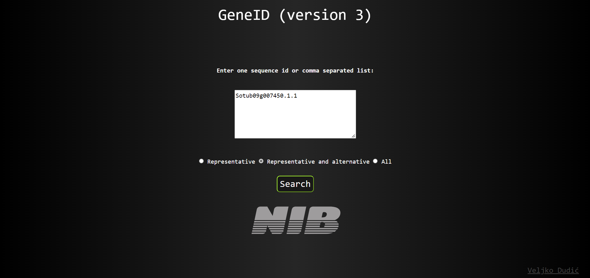
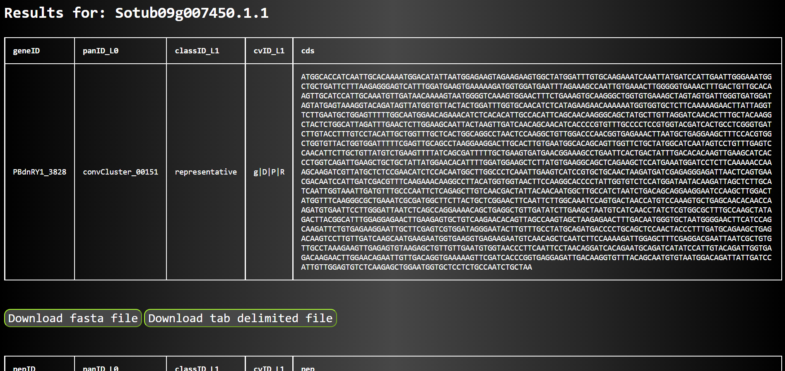

# geneID v3

## About the App


geneID v3 is a browser-based application that takes user’s defined sequenceID, or a comma-separated list of sequenceIDs, and returns corresponding coding sequences (_cds_) and polypeptide (_pep_) sequences in the new tab. 
User is able to choose to download visualised results either as TAB-separated (```.txt```) files or FASTA (```.fasta```) files, or both. 
Moreover, user can choose to conduct a query across three hierarchical levels of information: 
1. Considering representative sequences only
2. Considering alternative and representative sequences
2. All sequences – i.e. alternative, representative and cultivar-specific sequences

At the time, geneID contains potato sequenceIDs and corresponding sequences, however it is organism-agnostic. 


*Landing page, query option1*



*Landing page, query option2*



*results page*


## Dependencies

## SetUp

## DB creation


# Hints section
## subset fasta
```
for f in *fasta; do
    echo $f
    xargs faidx -d ' ' $f \
    < 5cv_weak-components_extract-IDs.txt > \
    ./out/subset_$f 2> ./err/subset_$f.error;
done;
```

## tab to fasta
<https://fairdomhub.org/data_files/3420>

## fasta to tab
<https://bioinformatics.stackexchange.com/questions/14818/creating-a-tab-delimited-file>

## MS SQL MySQL migrations 

<https://www.mysql.com/products/workbench/migrate/>

<https://dev.mysql.com/doc/workbench/en/wb-migration-install.html>


## FLASK

<https://blog.appseed.us/flask-react-full-stack-seed-projects/>

<https://dev.to/dev_elie/connecting-a-react-frontend-to-a-flask-backend-h1o>

<https://flask.palletsprojects.com/en/2.0.x/>

<https://dev.to/gajesh/the-complete-flask-beginner-tutorial-124i>

## other tools
<https://igraph.org/>

<https://cytoscape.org/>

<https://github.com/neo4j/neo4j>

## FASTA files
<https://fairdomhub.org/assays/1268?graph_view=tree>

<https://fairdomhub.org/data_files/3424>

<https://fairdomhub.org/data_files/3415>

